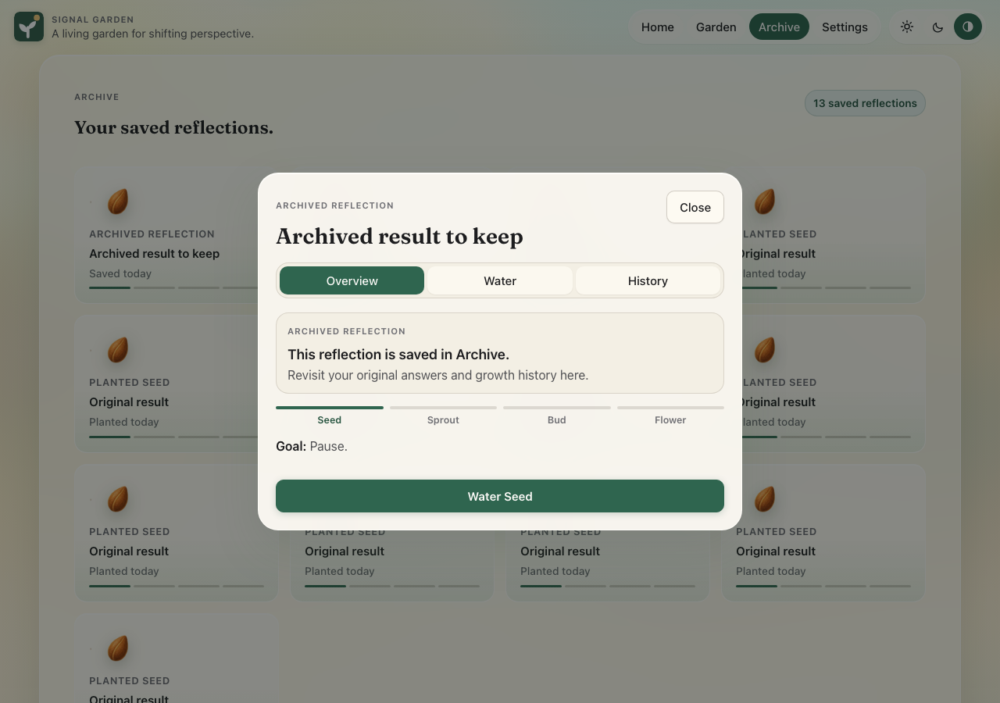
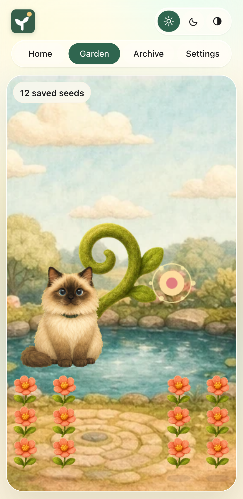

# Reflection reliability and garden review fixes

This change addresses the ten findings from the review of `ac4a811`.

| Phase | Result                                                                                                                                                              | Regression checks                                                                                        |
| ----- | ------------------------------------------------------------------------------------------------------------------------------------------------------------------- | -------------------------------------------------------------------------------------------------------- |
| SG-01 | Failed writes retain reflections. Full storage remains readable. Migration validates the destination before retiring legacy keys.                                   | Reflection-store failure, migration, corruption and retry tests; browser recovery tests.                 |
| SG-02 | Commands acquire an origin lock and read current records. Deleted seeds cannot return through stale tabs.                                                           | Concurrent command tests; independent two-tab watering, planting, deletion and lock-release checks.      |
| SG-03 | Current answers save before submission. Conflicts preserve local text and offer recovery export.                                                                    | Draft hook tests; browser dismissal, reload, queued typing and completion-failure checks.                |
| SG-04 | A completed reflection can go directly to Archive. History survives. Export and deletion include pending reflections, while deletion preserves unfinished journeys. | Archive, history, export and deletion checks; pending-only keyboard navigation regression.               |
| SG-05 | Twelve plot identities remain available on mobile. Plot taps and dragging work beside the companion.                                                                | Layout tests and browser tests for every plot, viewport changes, archive filtering and legacy placement. |
| SG-06 | Either the app or OS preference reduces motion in both CSS and Phaser.                                                                                              | Four preference combinations, live OS changes, reload, themes and mobile sheets.                         |
| SG-07 | Maintenance tools process PNG and WebP inputs with the same recipes and correct output encoding.                                                                    | Copied runtime fixtures, decoded pixel comparisons, empty-input checks and art audits.                   |

## Data behavior

The authoritative reflection document is `signal-garden/reflections/v2`. It contains the saved seeds, pending reflection and unfinished draft. Settings and the lens profile remain separate. Successful storage writes acknowledge the committed document directly. Subscriber or legacy-cleanup failures cannot turn a durable save into an apparent failure.

Web Locks serialize mutations across tabs. Unsupported browsers retain viewing and export access. Drafts have session identities and revisions so a stale tab cannot overwrite a newer answer. The app shows whether the current answer has saved. Closing the browser before that save completes can still lose unsaved text.

Placement and growth status are separate. Archived reflections do not occupy garden plots or grow passively. Pending reflections can be exported or deleted but do not offer care controls until saved. Older tabs must reload after migration to use the new document.

## Verification

Run the complete checks with:

```sh
pnpm typecheck
pnpm test
pnpm test:scripts
pnpm lint
pnpm format:check
pnpm art:audit
pnpm e2e
pnpm build
```

Playwright starts its own server and rejects reuse. Set `SIGNAL_GARDEN_TEST_PORT` when running another checkout concurrently. Resize checks wait for the requested container width and matching canvas dimensions before clicking.

Independent live checks reproduced the original data-loss failures before verifying recovery, full storage, concurrent tabs, complete history and delayed writes. Asset commands ran against temporary copies; all 59 committed asset hashes stayed unchanged. Matched local performance probes covered saving, concurrency, typing, Archive navigation, resizing, motion and image processing. Measurements on the shared development machine are regression checks, not product benchmarks.

Browser regression tests and fixture tooling checks are committed so CI can catch recurrence. The screenshots below use synthetic reflections.




